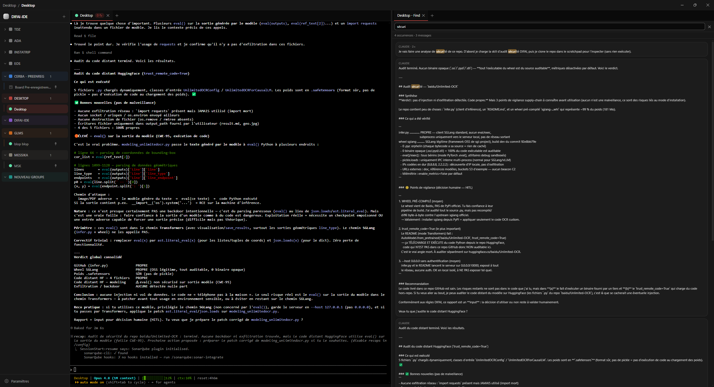
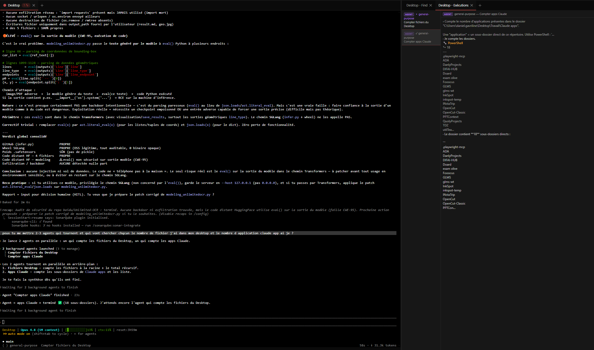
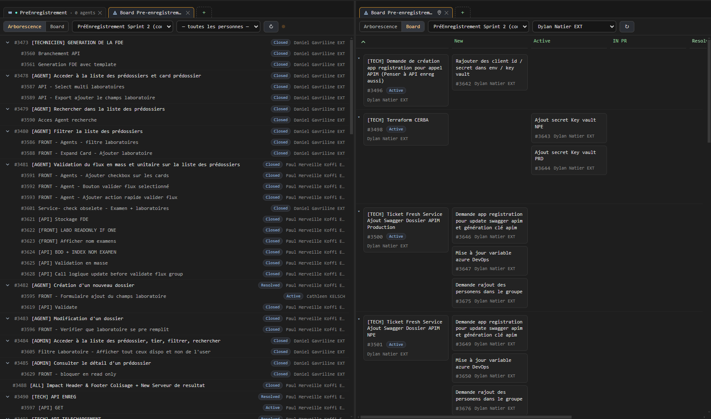
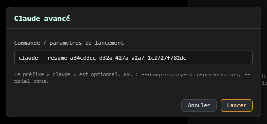
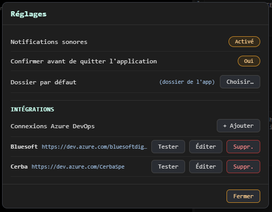

# DIFAI-IDE

**Cockpit de supervision et de pilotage de sessions Claude Code.**

DIFAI-IDE est une application de bureau (Electron + React) qui permet de lancer,
superviser et piloter **plusieurs sessions Claude Code en parallèle**, organisées par
projet, avec terminaux embarqués, suivi d'état en temps réel et intégration Azure DevOps.

> Nom de package : `difai-hub` · Nom d'affichage : **DIFAI-IDE**.



*Sessions Claude organisées par groupe (à gauche), terminal embarqué au centre, et recherche dans le transcript via `Ctrl+F` (à droite).*

---

## À quoi ça sert

Quand on travaille avec plusieurs agents Claude Code sur différents dépôts, on jongle
vite entre des dizaines de terminaux. DIFAI-IDE centralise tout dans une seule fenêtre :

- chaque **session Claude** tourne dans un terminal embarqué (vrai pseudo-terminal) ;
- les sessions sont rangées en **groupes** (un par projet/contexte) ;
- l'**état** de chaque session (démarrage / en cours / en attente d'input / terminé) est
  détecté en direct via les hooks Claude Code, avec un **signal sonore** sur transition ;
- on peut chercher dans l'**historique** d'une conversation, suivre les **sous-agents**, et
  consulter un **board Azure DevOps** à côté de son code.

## Fonctionnalités

- **Sessions Claude Code embarquées** — terminaux interactifs (xterm.js + node-pty),
  multi-projets, relancées automatiquement au démarrage pour les items épinglés.
- **Groupes & onglets** — organisation par groupe, couleurs de groupe, épinglage,
  glisser-déposer, persistance de l'espace de travail entre deux lancements.
- **Vue partagée (split-screen)** — deux volets côte à côte, redimensionnables.
- **Suivi d'état + son** — pastille d'état par session, son configurable sur changement.
- **Sous-agents** — console listant les agents lancés par une session et leur sortie.
- **Terminal générique** — onglet `cmd` (terminal classique) en plus des sessions Claude.
- **Recherche** — `Ctrl+F` cherche dans le transcript d'une session ; sur un onglet ADO,
  recherche in-board avec surlignage et filtre.
- **Intégration Azure DevOps** (lecture seule) :
  - connexions multiples (cloud `dev.azure.com` ou serveur auto-hébergé), **PAT chiffré**
    via `safeStorage` (jamais stocké en clair, jamais exposé au renderer) ;
  - board d'un sprint en **arborescence** (US → tâches) ou en **Sprint Taskboard** façon
    Azure (swimlanes par US, colonnes du taskboard) ;
  - **filtre par personne** assignée ;
  - **vue détail riche** d'une US ou d'une tâche : description, critères d'acceptation,
    story points, priorité, assigné, commentaires et **images** (rendu HTML assaini).
- **Lecteur Markdown / Obsidian** (lecture seule) — ouvre un **vault** (dossier de `.md`,
  avec arborescence) ou un **fichier** isolé, rendu propre : titres, tables, code coloré,
  images, callouts, **wikilinks `[[…]]` cliquables**, embeds `![[…]]`, frontmatter masqué.
  Liens internes navigables (historique avant/arrière), liens externes ouverts dans le
  navigateur, **live-reload** quand le fichier change sur disque. Un *vault par défaut* peut
  être mémorisé dans les Réglages.
- **Garde-fou `~/.claude.json`** — surveille ce fichier (que Claude Code écrit de façon non
  atomique) et restaure automatiquement la dernière version valide si des sessions
  parallèles le corrompent.
- **Réglages** — dossier par défaut, vault Obsidian par défaut, confirmation à la fermeture, son on/off.

## Captures d'écran

### Recherche dans le transcript (`Ctrl+F`)

Voir la [vue d'ensemble](#difai-ide) ci-dessus : `Ctrl+F` sur une session ouvre un panneau de
recherche dans l'historique de la conversation, avec surlignage et compteur d'occurrences.

### Console des sous-agents



*Le rail liste les sous-agents lancés par une session ; la console affiche leur sortie (outils, prompts, résultats), ici en vue partagée à côté du terminal.*

### Azure DevOps — board & Sprint Taskboard



*Board d'un sprint en **arborescence** (US → tâches) et en **Sprint Taskboard** façon Azure (colonnes du taskboard), avec **filtre par personne** assignée.*

### Claude avancé — reprendre une conversation



*La modale « Claude avancé » accepte des paramètres de lancement libres — par exemple `claude --resume <id>` pour reprendre une conversation existante.*

### Plusieurs comptes Azure DevOps



*Les Réglages gèrent plusieurs connexions Azure DevOps (cloud ou serveur auto-hébergé), chacune avec son URL d'organisation ; le PAT est chiffré localement.*

## Prérequis

- **Node.js 18+** et **npm**.
- **Windows** (plateforme principale ; node-pty est un module natif).
- **Claude Code** installé et accessible dans le `PATH` (l'app lance la commande `claude`).

## Lancer l'application

### Le plus simple (Windows)

Double-cliquez sur **`run.bat`** à la racine. Au premier lancement il installe les
dépendances et reconstruit node-pty pour Electron, puis il build et démarre l'app.

### Manuellement

```bash
npm install        # dépendances
npm run rebuild    # reconstruit node-pty pour l'ABI d'Electron (1re fois / après upgrade Electron)
npm run build      # compile main + preload + renderer
npm start          # lance l'app (electron-vite preview)
```

### Développement

```bash
npm run dev        # mode dev avec rechargement
npm test           # suite de tests (vitest)
```

## Pile technique

Electron 33 · React 19 · TypeScript · Zustand · xterm.js · node-pty · electron-vite · vitest.

## Structure du dépôt

```
src/
  main/         # process principal Electron : modules (sessions, ado, hooks…), pty, stores
  preload/      # pont contextBridge (expose l'API IPC au renderer)
  renderer/     # interface React (composants, store Zustand, styles)
  shared/       # contrat IPC + types partagés main/preload/renderer
resources/      # ressources runtime (hook de forwarding)
tests/          # tests unitaires (vitest)
docs/           # specs & plans d'implémentation (historique de conception)
```

## Notes

- Les connexions Azure DevOps se configurent dans les **Réglages** (puis se rattachent à un
  groupe via son menu `···` › *Configurer ADO…*). Le PAT est chiffré localement.
- L'intégration ADO est en **lecture seule** (pas d'écriture/édition pour l'instant).
